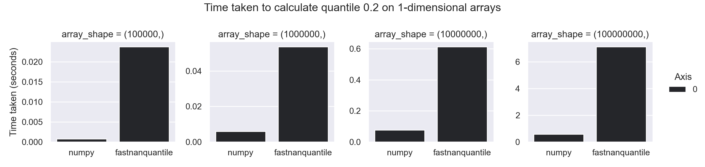

[](https://github.com/psf/black)

[](https://colab.research.google.com/github/lbferreira/fastnanquantile/blob/main)
[](https://pypi.python.org/pypi/fastnanquantile)
[](https://pepy.tech/project/fastnanquantile)
[](https://anaconda.org/conda-forge/fastnanquantile)
[](https://anaconda.org/conda-forge/fastnanquantile)
# fastnanquantile
An alternative implementation of numpy's nanquantile function. It's faster in many cases, especially for 2D and 3D arrays.
Note that np.quantile is much faster than np.nanquantile, but it doesn't support NaN values. This package is intended to be used when NaN values are present in the data.

## Installation
To install the package using pip:
```
pip install fastnanquantile
```
To install the package using conda:
```
conda install -c conda-forge fastnanquantile
```

## Usage
The function was designed to be very similar to numpy's nanquantile function. 
Example:
```python
import numpy as np
import fastnanquantile as fnq

sample_data = np.random.random((50, 100, 100))
start = time.time()
np_result = np.nanquantile(sample_data, q=0.6, axis=0)
print(f'Time for np.nanquantile: {time.time() - start}s')
# Printed: Time for np.nanquantile: 0.2658s
start = time.time()
fnq_result = fnq.nanquantile(sample_data, q=0.6, axis=0)
print(f'Time for fnq.nanquantile: {time.time() - start}s')
# Printed: Time for fnq.nanquantile: 0.0099s
# Disclaimer: The time for the first call to fnq.nanquantile is slower than
# the following calls, due to the compilation time of the function.
```

## Xarray compatible function
Xarray is a powerful library for working with multidimensional arrays. It can be used to compute quantiles along a given dimension of a DataArray. Numpy's nanquantile function is used under the hood. To extend the use of fastnanquantile to xarray, a funtion is provided to compute quantiles for a DataArray, with a similiar behavior of xarray's quantile implementation.
Example:
```python
import numpy as np
import xarray as xr
from fastnanquantile import xrcompat

da = xr.DataArray(
    np.random.rand(10, 1000, 1000),
    coords={"time": np.arange(10), "x": np.arange(1000), "y": np.arange(1000)},
)

# Xarray quantile (time to run: ~25s)
result_xr = da.quantile(q=0.6, dim="time")
# fastnanquantile (time to run: <1s)
result_fnq = xrcompat.xr_apply_nanquantile(da, q=0.6, dim="time")
# Check if results are equal (If results are different, an error will be raised)
np.testing.assert_almost_equal(result_fnq.values, result_xr.values, decimal=4)
```
A case study using Xarray + Dask to create time composites from satelitte images can be found in this notebook: [examples/example_xarray.ipynb](examples/example_xarray.ipynb).

## Benchmarks
Some benchmarks were made to compare the performance of fastnanquantile with numpy's nanquantile function. More information can be found in this notebook: [examples/example.ipynb](examples/example.ipynb).



**Benchmarks conclusions**

The performance gains offered by the fastnanquantile implementation depends on the shape of the input array.
Based on the benchmark results, we can conclude:
- 1D arrays: numpy is faster.
- 2D arrays: fastnanquantile is faster for arrays with axis with sizes noticeably different from each other (example: (50, 1000)).
- 3D arrays: fastnanquantile is generally faster, especially when the reduction axis is smaller than the other ones. For example, with shape=(50, 1000, 1000) and reduction axis=0, fastnanquantile is a lot faster than numpy.
- Finally, fastnanquantile can be a great alternative in many cases, especially for 2D and 3D arrays, with potential to greatly speedup quantiles computation.

## Acknowledgements
This library was developed as part of
my research work in the [GCER lab](https://www.gcerlab.com/), under supervision of Vitor Martins, at the Mississippi State University (MSU).

This research is funded by USDA NIFA (award #2023-67019-39169), supporting Lucas Ferreira and Vitor Martins at MSU.